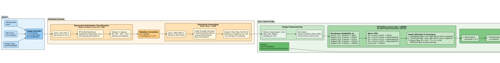
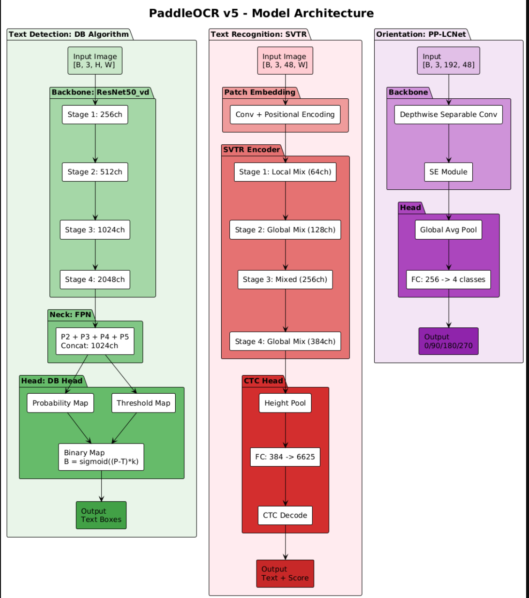
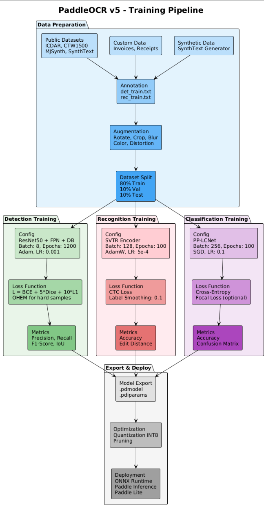
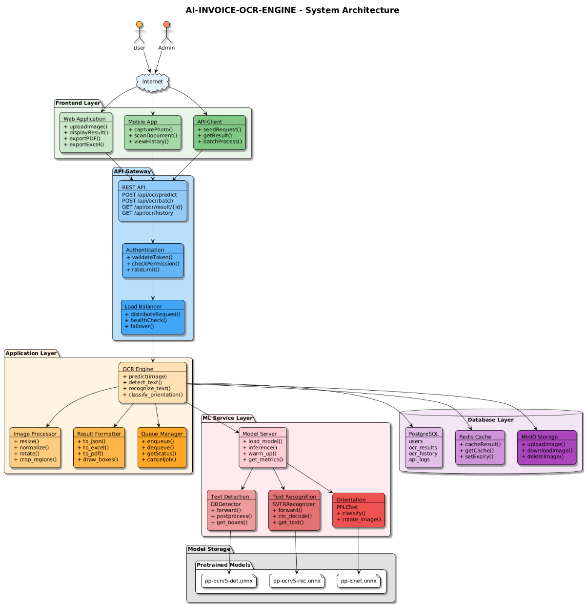
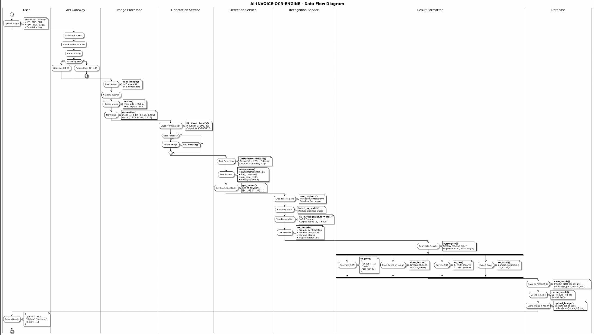
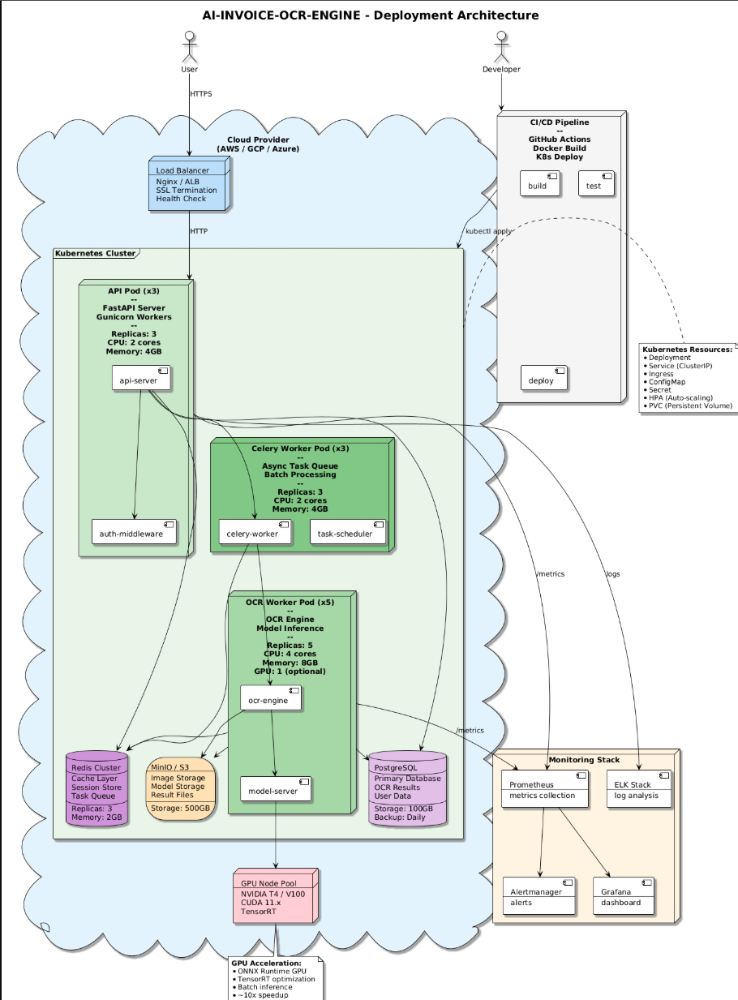
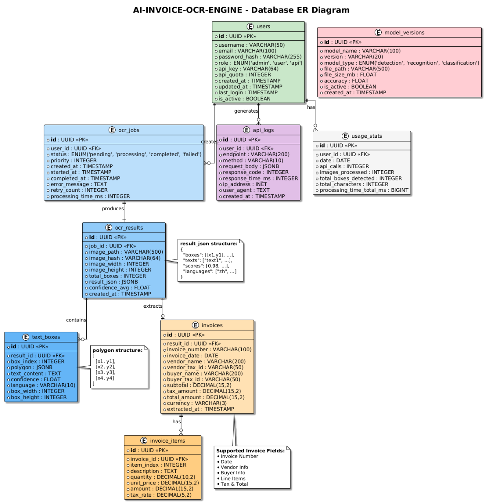

# AI-INVOICE-OCR-ENGINE

**中文版** | [English](README.md)

一個基於 **PaddleOCR v5** 的完整 AI 文件光學字元辨識 (OCR) 解決方案，針對發票和會計文件辨識進行優化，支援中文和英文文字識別。

## 展示 Demo

### 中文發票

| 原圖 | OCR 辨識結果 | 文字輸出 |
|------|-------------|----------|
|  |  |  |

### 英文發票

| 原圖 | OCR 辨識結果 | 文字輸出 |
|------|-------------|----------|
|  |  |  |

## 架構圖

### 1. OCR 推論流程


### 2. 模型架構


### 3. 訓練流程


### 4. 系統架構


### 5. 資料流程


### 6. 部署架構


### 7. 資料庫 ER 圖


## 功能特色

- **高準確率**：採用 PP-OCRv5 伺服器級模型，提供卓越的辨識品質
- **多語言支援**：支援中文、英文及混合文字辨識
- **文件前處理**：自動方向校正和文件扭曲矯正
- **邊框視覺化**：在偵測到的文字區域繪製綠色框框
- **文字匯出**：將辨識結果儲存到 TXT 檔案
- **易於整合**：簡單的 Python API，快速部署

## 架構概述

```
輸入圖片 → 前處理 → 文字偵測 → 文字辨識 → 輸出結果
                        ↓            ↓
                    綠色框框      TXT 檔案
```

### 流程元件

| 元件 | 模型 | 說明 |
|------|------|------|
| 文件方向偵測 | PP-LCNet | 分類文件旋轉角度 (0°/90°/180°/270°) |
| 文件扭曲矯正 | UVDoc | 校正彎曲/扭曲的文件 |
| 文字偵測 | PP-OCRv5_det (DB) | 使用可微分二值化演算法偵測文字區域 |
| 文字行分類 | PP-LCNet | 判斷文字行方向 (0°/180°) |
| 文字辨識 | PP-OCRv5_rec (SVTR) | 使用場景文字辨識模型搭配 CTC 解碼 |

### 模型架構

- **文字偵測 (DB 演算法)**
  - 主幹網路：ResNet50_vd
  - 特徵融合：特徵金字塔網路 (FPN)
  - 輸出頭：可微分二值化，包含機率圖、閾值圖和二值圖

- **文字辨識 (SVTR)**
  - 區塊嵌入與位置編碼
  - 四階段編碼器，包含局部和全域混合
  - CTC（連結時序分類）解碼器
  - 詞彙表：6,624 個字元

## 安裝說明

### 系統需求

- Python 3.8+
- Windows/Linux/macOS

### 安裝相依套件

```bash
pip install paddlepaddle>=2.5.0
pip install paddleocr>=3.0.0
pip install pillow>=9.0.0
pip install opencv-python>=4.5.0
```

## 快速開始

### 基本使用

```python
from paddleocr import PaddleOCR

# 初始化 OCR 引擎
ocr = PaddleOCR(
    use_doc_orientation_classify=False,
    use_doc_unwarping=False
)

# 對圖片執行 OCR
result = ocr.predict('invoice.png')

# 處理結果
for item in result:
    if 'rec_texts' in item:
        for i, text in enumerate(item['rec_texts']):
            score = item['rec_scores'][i]
            print(f"文字: {text}, 信心度: {score:.2%}")
```

### 只畫框框（圖片上不顯示文字）

```python
import cv2
import numpy as np

def draw_boxes_only(image_path, boxes, output_path):
    img = cv2.imread(image_path)
    for box in boxes:
        pts = np.array(box).astype(np.int32)
        cv2.polylines(img, [pts], True, (0, 255, 0), 2)
    cv2.imwrite(output_path, img)
```

### 儲存結果到 TXT

```python
def save_text_to_file(txts, scores, output_path):
    with open(output_path, 'w', encoding='utf-8') as f:
        for i, (txt, score) in enumerate(zip(txts, scores)):
            f.write(f"{i+1}. {txt} (信心度: {score:.2%})\n")
```

## 專案結構

```
AI-INVOICE-OCR-ENGINE/
├── README.md
├── README_CN.md
├── LICENSE-MIT
├── setup.py
├── demo/
│   ├── invoice_ch.png           # 中文發票（輸入）
│   ├── invoice_en.png           # 英文發票（輸入）
│   ├── result_invoice_cn.jpg    # 中文辨識結果（輸出）
│   ├── result_invoice_en.jpg    # 英文辨識結果（輸出）
│   ├── 1.png ~ 7.png            # 架構圖
│   └── *.puml                   # PlantUML 原始檔
├── models/
│   └── pretrained/
│       └── weights/             # 模型檔案 (.onnx, .pdmodel, .pdiparams)
├── preprocess/
├── detect/
├── recognize/
├── data/
├── losses/
├── train/
└── utils/
```

## 效能表現

| 模型 | 大小 | 推論時間 (CPU) | 準確率 |
|------|------|----------------|--------|
| PP-OCRv5_det | ~88MB | ~200ms/張圖片 | F1: 0.85+ |
| PP-OCRv5_rec | ~85MB | ~50ms/文字行 | 準確率: 0.95+ |
| PP-LCNet (方向) | ~7MB | ~10ms/張圖片 | 準確率: 0.99+ |

*測試環境：Intel i7-10700 CPU

## 支援的文件類型

- 發票和收據
- 財務報表
- 合約和協議書
- 身分證件和證書
- 一般印刷文件
- 中英文混合文件

## 作者

**Jammy Lin**
Email: a0925281767s@gmail.com

## 授權條款

本專案採用 MIT 授權條款 - 詳見 [LICENSE-MIT](LICENSE-MIT) 檔案。

## 致謝

- [PaddleOCR](https://github.com/PaddlePaddle/PaddleOCR) - 底層 OCR 引擎
- [PaddlePaddle](https://www.paddlepaddle.org.cn/) - 深度學習框架

## 參考資料

- PP-OCRv5：[PaddleOCR 官方文件](https://paddlepaddle.github.io/PaddleOCR/)
- DB 演算法：[Real-time Scene Text Detection with Differentiable Binarization](https://arxiv.org/abs/1911.08947)
- SVTR：[SVTR: Scene Text Recognition with a Single Visual Model](https://arxiv.org/abs/2205.00159)

---

## ⭐ 支持這個專案

如果這個專案對你有幫助，請給一個 **Star**！

你的支持是我持續改進的動力！

[](https://github.com/xup6jammy/AI-INVOICE-OCR-ENGINE)

**支持方式：**
- ⭐ 給這個專案 Star
- 🍴 Fork 並貢獻程式碼
- 🐛 回報問題和建議
- 📢 分享給其他人！
